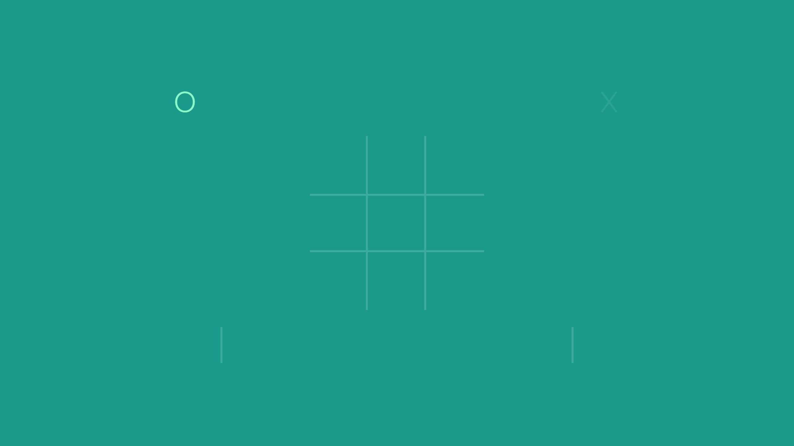
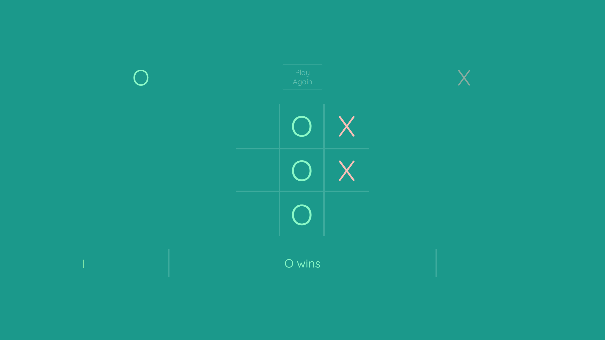
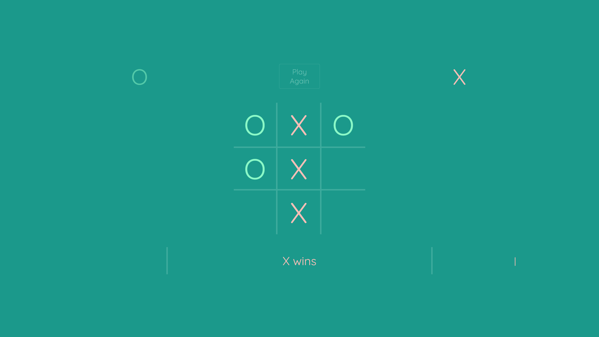
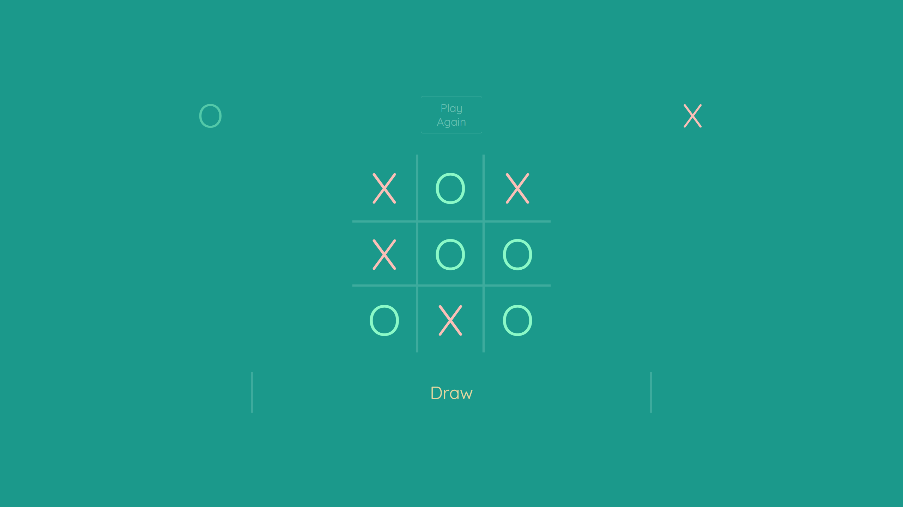

<h1 align='center'> Tic Tac Toe </h1>

## **Deployment Link** 🔗
https://tic-tac-toe-mauriciolovera.netlify.app/

## **Description** 📃
A playable replication of **Tic-Tac-Toe** utilizing JavaScript browser events!
 
## **Features** 😲
- Game win-loss-draw states.
- A score tracker that persists through rounds.

## **Icebox** 🧊

- [ ] A complete migration to React. 
- [ ] Tally mark animations when wins have approached 5 or more!

## **Technologies Used** ⚙

## **Screenshots** 📷

<h3 align='center'> Game Initalization </h3>
 

<h3 align='center'> O wins </h3>
 

<h3 align='center'> X wins </h3>
 

<h3 align='center'> Draw </h3>
 

